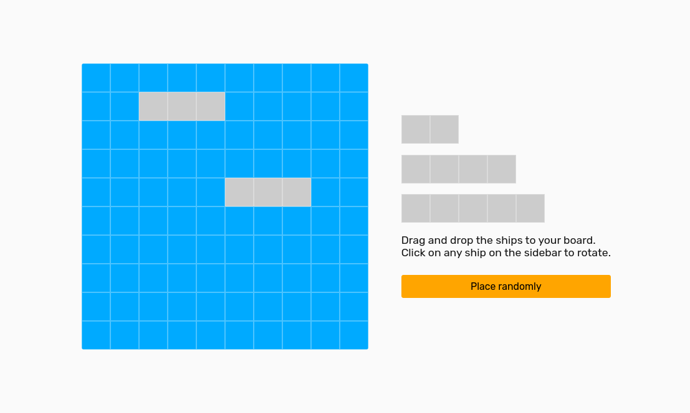
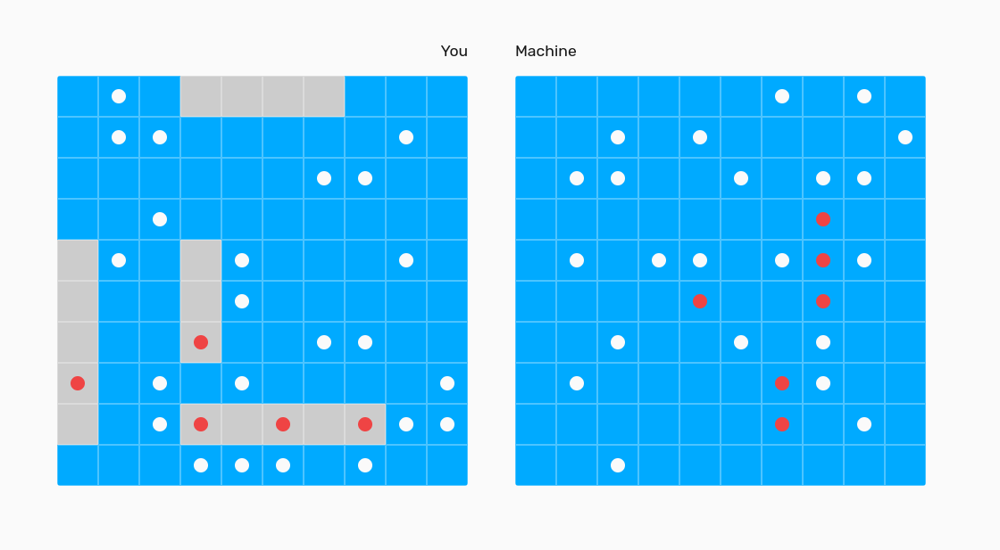

# Battleship

- Supports both random and manual(drag-and-drop) placement of ships
- Great UI
- Well designed code tested using Jest 
- Mobile responsive
- Made part of Odin Project TDD Curriculum entirely using HTML, CSS, JavaScript 